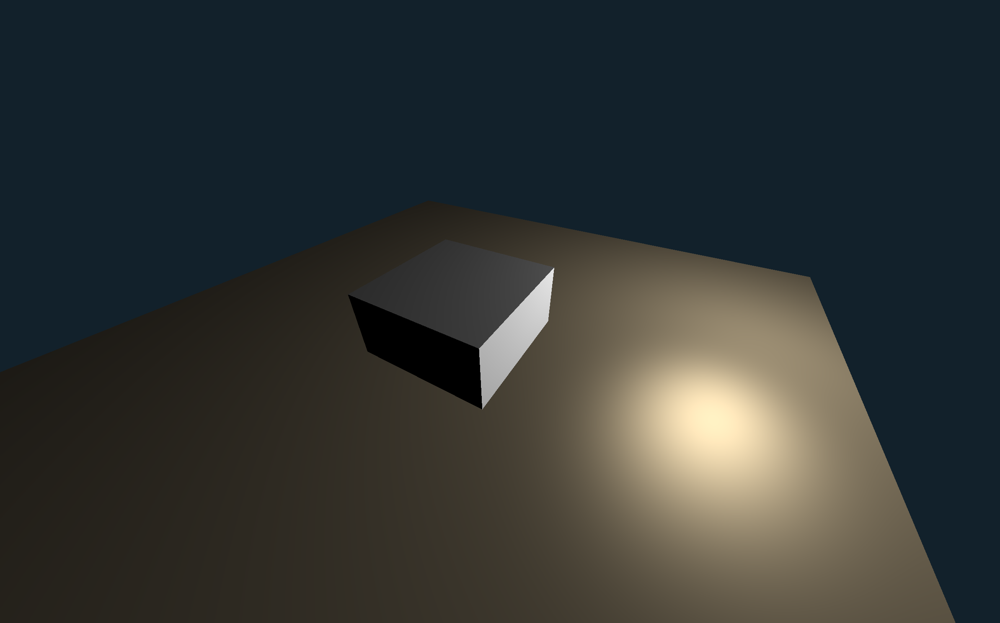

# Empire

## Présentation

Empire est un projet qui a pour but final de recréer le chien robot Spot de Boston Dynamics. \
Ce projet se découpe ainsi en 4 étapes :
- Créer le moteur 3D pour visualiser le chien
- Y implémenter un moteur physique pour l'environnement d'entraînement du chien
- Écrire le chien robot (contrôles moteur, données captées, etc)
- Mettre une IA (Soft Actor-Critic dans ce cas) dans le chien pour qu'il apprenne à marcher

## Lancer le projet

Tout d'abord, il vous faut avoir installé les bibliothèques précompilées `GLFW` et `GLM` sur votre ordinateur. \
Ensuite, saisissez la commande suivante :

> `$ g++ -std=c++20 ... src/core/main.cpp src/maths/utils.cpp src/three/main.cpp src/opengl/main.cpp src/lib/glad.o -o main`
> 
*Note : les `...` représentent ici les flags afin de lier GLFW et GLM au projet.* \
*Exemple : `-F/Library/Frameworks -framework GLFW -L/opt/homebrew/include etc`*

## Exemples

>  \
> *Exemple du moteur 3D*