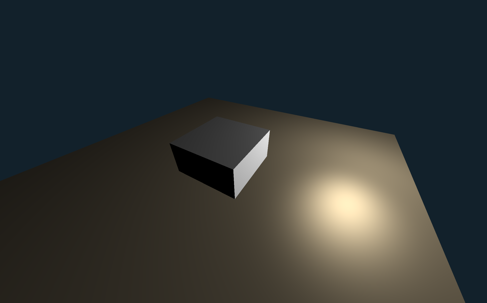
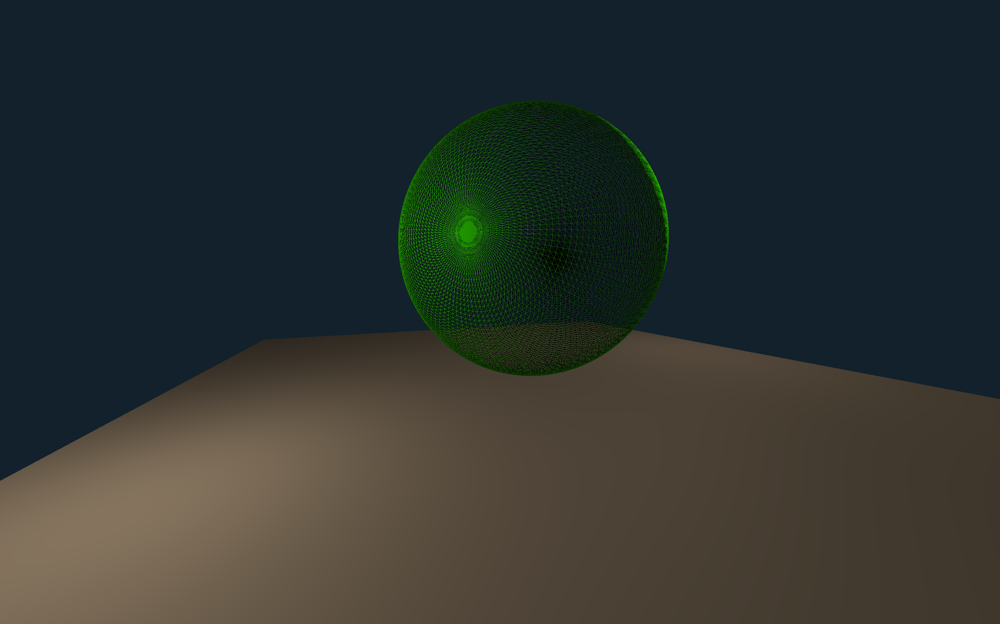

# Empire

## Overview

*Empire* is a project with the ultimate goal of **recreating Boston Dynamics' robot dog**, Spot. \
The project is divided into *four* main phases:
- *Develop* a **3D engine** to visualize the robot dog
- *Implement* a **physics engine** for the dog’s ***training environment***
- *Program* the **robot dog (motor controls, data acquisition, etc.)**
- *Integrate* an **AI (Soft Actor-Critic in this case)** into the dog to teach it how to ***walk***

## Running the Project

First, ensure that the precompiled libraries `GLFW` and `GLM` are installed on your machine. \
Next, run the following commands:
```bash
g++ -std=c++20 ... src/core/main.cpp src/maths/utils.cpp src/three/main.cpp src/opengl/main.cpp src/lib/glad.o -o main
```
```bash
./main
```

> *Note: The `...` represents the flags for linking GLFW and GLM to the project.* \
> *Example: `-F/Library/Frameworks -framework GLFW -L/opt/homebrew/include etc`*

## Examples

### 3D Engine

>  \
> *A cube intersecting a plane*

>  \
> *A skeletal UV sphere*
